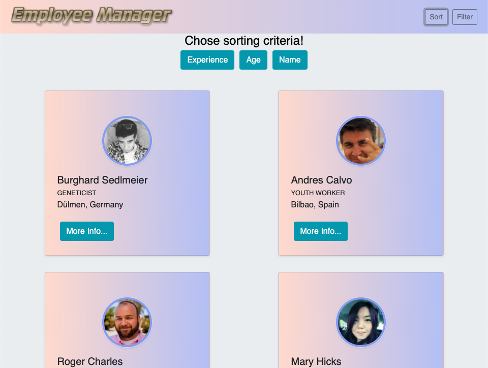
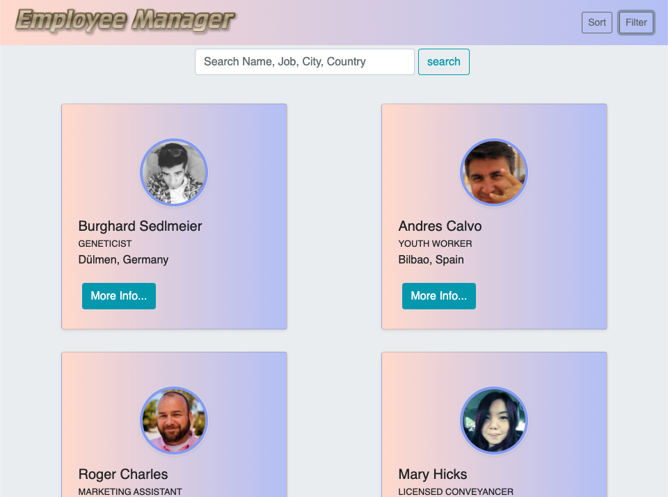

# Employee Manager [](https://opensource.org/licenses/MIT)

## Table Of Contents

1. [License](#license)

2. [Description](#description)

3. [Installation](#installation)

4. [Usage](#usage)

5. [Contribution](#Contribution)

6. [Questions](#questions)

## Description

Deployed Link: [https://paveldarii.github.io/employee-manager/](https://paveldarii.github.io/employee-manager/)

This app will allow employer or managers to view non-sensitive data about other employees in their company.

Technologies: Node, CSS, HTML, React, WebPack, Babel, Bootstrap, and other libraries.

## Installation

To instal the app follow next steps.

1. Clone the app on your computer.

```bash
git clone git@github.com:paveldarii/employee-manager.git
```

2. Install all npm packages

```bash
npm i
```

3. Run the app

```bash
npm start
```

If you have any difficulties with installing the app, contact me on the email bellow.

## Usage

Being on the page you can directly start to look for the employee you need by going through the displayed list of all employee cards.


Next, this application will allow their users to sort employee list by age, experience, or age



Also, users will be able to filter employee list by name, job, city, or country after selecting the filter option in the Nav Bar.



Finally, if user found the employee he or she needs; then, they can learn more about the employee by pushing "More Info" button located on each card.


## Contribution

I am open to any contributions, so if you want to be part of this project contact me on the email bellow. Thank you.

## Questions

My GitHub profile: [https://github.com/paveldarii](https://github.com/paveldarii).

My email address: paveldarii@yahoo.com

## License

[The MIT License](https://opensource.org/licenses/MIT/)
